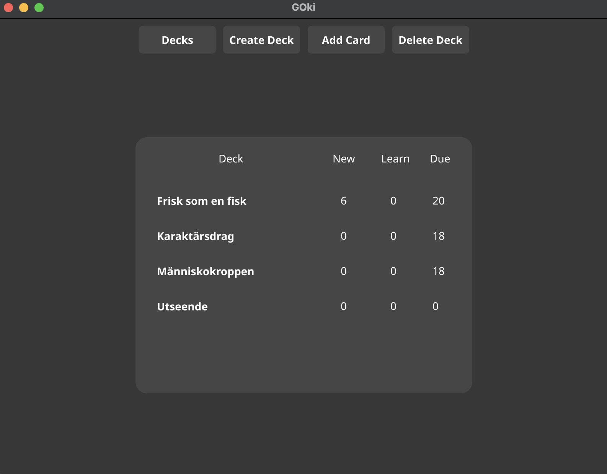

# Goki

An Anki style app written in Go

`install.sh` installs the app on your Mac! It can be modified to install on Linux as well. The default installation contains 4 flipcard decks with Slovak and Swedish words. Try it or create your own!

The idea behind this project was to combine two activities I enjoy into one - language learning and coding. I used Anki in the past, but I felt like I could do something similar and learn a new programming language (and Swedish) in the process.

## Capabilities
- The idea was simple: make it just like Anki. The interface is a bit different, mostly due to Go and the given frontend possibilities. I wanted to create at least a simple interface instead of a CLI app.
- Dataset creation/deletion, as well as adding a new card to an already existing deck, is done simply by pressing a few buttons.

- Anki, as well as Goki, uses a smart learning algorithm for card selection by taking into account how many times you have seen each card and your level of knowledge about it. This is calculated by the options you choose when you see a card. The algorithm then selects which cards you should see more and less often in specific time intervals.

## Future Plans
- Add Markdown support
- Enhance the user interface with more customization options.
- Add a statistics dashboard to track learning progress over time.
